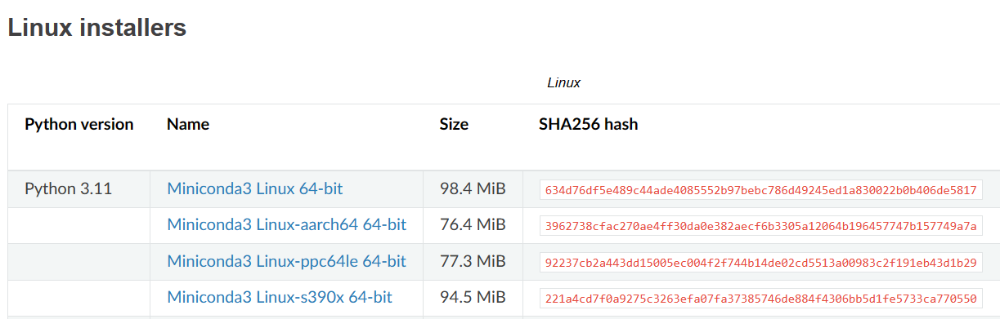

# Practica No.1 _Instalacion de Herramientas_


## Introducción

<!-- -->


Actualmente hay una cantidad extensa de sistemas operativos, que trabajan en diferentes entornos que permiten el uso de estas herramientas como interfaces para el usuario para que se pueda comunicar con el sistema, sin embargo estas distribuciones tienen una índole de acceso libre o privado, como es el caso de Windows pues a pesar de que corre en la mayoría de dispositivos portátiles de 32 y 64 bits, requiere de una licencia puesto que su uso es controlado por Microsoft. Hay una línea de sistemas operativos que ha sido clave para varios aparatos electrónico tal es el caso de GNU/Linux como Android usan el kernel Linux como base software, porque es de acceso libre, no es correcto decir que linux es solamente un sistema operativo, ya que hay varias versiones si es que se le puede llamar así, ya que cada versión que sacan por lo general se basa en un versión completamente distinta recogiendo cosas importantes de esa variante para mejorarla, y que logré adecuarse a los gustos o necesidades del usuario, sea por su diseño, poco consumo de recurso, o por la característica de que hay ciertos programas que corren solo en linux, siendo una ventaja considerable para ciertos tipos de ambiente.

<p align="center">
    
</p>

## Objetivos

• Identificar las diferentes herramientas necesarias para la instalación de Linux Mint.

•	Lograr configurar adecuadamente las propiedades de una máquina virtual, para el correcto uso de Linux Mint.

•	Comprender el proceso de instalación de paquetes, aplicaciones y actualizaciones mediante comandos en la consola.

•	Ejecutar adecuadamente los pasos o comandos para la instalación y ejecución de las herramientas en Linux Mint


## Metodología
Antes de entrar en detalle con los diferentes pasos, es necesario aclarar que la instalación de Linux aplica siempre para diferentes versiones o tipos de este mismo, no hay un único asi que antes de avanzar, es necesario tener en cuenta ¿Qué Linux es de interes para el usuario especifico? instalar el ISO y montarlo,pero... ¿Qué es un iso?.
Es un formato de archivo digital que replica un CD, DVD o BD físico. La extensión de archivo ISO no solo almacena archivos y carpetas, sino que aloja además toda la información vital de sistema de archivos acerca de la estructura del disco, casi como un programa.
La ultima aclaración es que la instalación de **Linux Mint** ( el de interes en esta guía) puede hacerse de dos maneras, por Maquina Virtual o por partición de disco a traves de la BIOS con una USB, ambos metodos seran descritos como Metodo MV, ó Metodo BIOS.

## Metodo MV:

### Herramientas
* Lo primero es establecer las herramientas necesarias para la instalación y el montaje de Linux Mint, solo vamos a requerir de 2 antes de entrar en el SO, Virtual Box e ISO de Linux Mint.
* Links: [Página de Virtual Box](https://www.virtualbox.org/),[Linux Mint](https://linuxmint.com/)
* Virtual Box:
Bajando un poco nos encontraremos con el bóton de descarga


solo lo clickeamos y nos encontraremos con los diferentes versiones de SO para instalarlo, escogemos el que tengamos:


Ya teniendo el archivo descargado simplemente lo ejecutamos, y le damos Next a todo.

* Linux Mint:

La descarga del ISO, solo consiste en entrar a la pagina y darle a descargar, sin embargo  esta nos llevara a una pestaña donde habra 3 versiones diferentes, para resumir, cada una consume mas o menos recursos, dependiendo del nivel de diseño y detalle que tenga cada uno en la interfaz de usuario, para este caso escogemos la que sea acorde a nuestro sistema, de bajos (XFCE Edition) , medios (Mate Edition) o altos requisitos(Cinammon Edition), una vez descargado la versión de preferencia, el formato dado sera ISO.


### Desarrollo

Ejecución Virtual Box:

Ejecutamos el el programa y nos llevara a esta interfaz:


Agregamos una maquina virtual, y configuramos los parametros segun nuestro preferencia, he aqui el resumen:


en 1 definimos el nombre de Usuario, del SO, en 2 la ubicación de la carpeta de la maquina ( normalmente predefinido en la instalación de Virtual Box), 3 como dice la casilla nombre del SO invitado, 4 la memoria RAM asignada, 5 números de núcleos del procesador a asignar, y 6 el tamaño del disco que usara el SO.


* Montaje del ISO:


En resumidas cuentas solo consiste, ir a configuración, Almacenamiento en este apartado vamos a Controlador IDE, como está vacío dado que es la primera vez, en la parte derecha de las pestañas donde hay un disco pequeño, seleccionamos y despliega diferentes opciones, como lo que necesitamos montar es el disco o ISO instalado le damos en select disk file, y eso nos llevara al explorador donde debemos buscar el ISO, (normalmente esta en la carpeta de descargas) .

* Ejecución de Linux Mint:

Por último solo nos queda dirigirnos a la casilla de Linux Mint en Virtual Box, e iniciar la máquina virtual


* Configuración del SO:

El inicio del SO, comienza con una subpestaña, un arranque parecido al de windows antes de llegar a la BIOS, y despues de un tiempo nos aparece estas opciones:


Solo debemos presionar Enter a la primera opción, siendo el nombre del SO montado en Linux.


Una vez en la interfax de Mint, nos aparecera en la esquina superior izquierda, ***Install Linux Mint***.

La instalación es netamente personal y a preferencia de cada usuario, aunque el idioma es importante dejarlo en inglés ya que la instalación de herramientas dentro de Linux Mint se utilizaran comandos en inglés en la consola, quitando eso la región del sistema, el nombre de usuario y contraseña si asi se desea es a elección personal.

_Consideraciones Importantes_


Hay que marcar la casilla de los codecs multimedia.


No borrara absolutamente ningún archivo del SO principal, solo escala nivel de la máquina virtual.

### Implementación de Herramientas 

Posterior a la instalación del SO, es necesario la instalación de cierto programas para desarrollo del curso, estos son:
* Miniconda
* Verilog 
* Yosys
* GtkWave

  
A continuación se explican de manera detallada que son y su proceso de instalación en Linux: 


**Miniconda:**

Anaconda es una distribución de los lenguajes de programación Python y R para computación científica, tiene como ventaja simplificar la gestión e                implementación de paquetes. Sin embargo, para algunos proyectos, no es necesario todo el conjunto de herramientas que Anaconda proporciona,                      para aquellos casos, existe Miniconda. Esta en comparación con la mencionada previamente, permite instalar de manera manual solo las herramientas                requeridas.

Para su proceso de instalación: 

En primer lugar, debe accederse al siguiente link [Ultimas versiones de Miniconda ](https://docs.conda.io/en/latest/miniconda-other-installer-links.html), alli se selecciona preferiblemente la ultima versión de Python para el sistema operativo en cuestión, en este caso linux, como se observa en la siguiente imagen:


    
Se tomara como ejemplo el archivo _Miniconda3 Linux 64-bit_, posterior a su descarga, en la terminal de comandos se ejecutan los siguientes comandos:

```bash
cd Downloads # Este comando redirige al usuario a la carpeta en cuestión 
bash Miniconda3-Linux-64-bit.sh # Este comando permite simplificar la ejecución de comandos contenidos en el archivo instalado
#Posteriormente se deben seguir la instrucciones alli dadas y despues reiniciar la consola.
```
Una vez ejecutadas esta series de comando, nuevamente en la terminal:

```bash
(base) $ conda update conda # Este comando permite actualizar Miniconda a su ultima version
(base) $ conda create -n digital python=3.11 # Crea y configura la variable de entorno digital para python=3.11
(base) $ conda activate digital  # Activa la variable de entorno de Miniconda denominada digital
(digital) $ python --version # Este comando permite ver la versión instalada de Python, en este caso la version 3.11 para
#poder continuar con la instalacion de los otros programas.
```
**Icarus Verilog** 

Verilog es un lenguaje de descripción de hardware (HDL), es ideal para la programación sencilla de FPGA’s Altera, este lenguaje soporta el diseño, prueba e implementación de circuitos analógicos, digitales y de señal mixta a diferentes niveles de abstracción. No obstante, Icarus Verilog se trata de un compilador, encargado de compilar código de fuente escrito en Verilog.

Para su proceso de instalación en el SO Linux, dentro de la terminal de comandos:
```bash
(base) $ conda install -c "litex-hub" iverilog
```
De manera detallada este comando le solicita a conda que instale desde el canal llamado "litex-hub", el paquete iverilog (en alusión a Icarus Verilog puntualmente). Cabe acalarar que Los canales son repositorios en línea donde se almacenan paquetes con software y bibliotecas listos para ser descargados e instalados. 

**Yosys** 

Yosys es una herramienta de código abierto, esencial en el flujo de diseño de hardware digital, ya que permite a los diseñadores transformar descripciones de alto nivel en diseños implementables y optimizad. Su nombre completo es "Yosys Open SYnthesis Suite"

Para su proceso de instalación en el SO, dentro de la terminal de comandos escribir:
```bash
conda install -c "litex-hub" yosys
```
Al igual que con el paquete iverilog, este comando le solicita a conda que instale desde el canal llamado "litex-hub", el paquete yosys. 

**GtkWave**

GTKWave es una herramienta de codigo abierto, enfocada a  diseñadores y verificadores de hardware digital, pues esta les permite visualizar y analizar las formas de onda generadas por simulaciones de circuitos digitales. Permitiendo  comprender mejor el comportamiento del hardware y a identificar problemas potenciales durante el proceso de diseño y verificación.

Para su proceso de instalación en el SO, dentro de la terminal de comandos escribir:
```bash
$ conda install -c conda-forge gtkwave 
```
De manera detallada, este comando le solicita a conda que instale desde el canal llamado "conda-forge", el paquete gtkwave.

**Grahpviz**
Graphviz es una herramienta para generar visualizaciones gráficas de grafos y diagramas de manera automática a partir de descripciones de alto nivel. Esto resulta especialmente valioso para entender las relaciones y las conexiones en sistemas complejos y datos estructurados.

Para su proceso de instalación en el SO, dentro de la terminal de comandos escribir:
```bash
$ conda install -c conda-forge graphviz
```
De manera detallada, este comando le solicita a conda que instale desde el canal llamado "conda-forge", el paquete graphviz.


Finalmente, posterior a la instalación de cada uno de estos paquetes, es posible verificar que fueron instalados correctamente revisando la version instalada, con la siguiente linea de comandos en la terminal:

```bash
$ iverilog -V # Permite observer la version de iverilog instalada
$ yosys --version # Permite observer la version de Yosys instalada
$ gtkwave --version # Permite observer la version de gtkwave instalada
$ dot -V # Permite observer la version de Graphviz instalada
```

## Resultados
Presenta los resultados de tu análisis o investigación de manera clara y concisa. Puedes utilizar tablas, gráficos u otros elementos visuales para resaltar los puntos clave.

## Discusión
Interpreta los resultados y ofrece insights sobre su significado. ¿Cómo se relacionan los resultados con los objetivos del informe? ¿Hay patrones o tendencias importantes?

## Conclusiones
Resume las conclusiones clave a las que has llegado en el informe. 

## Recomendaciones (si aplica)
* Problemas con VB:
* Pantalla Completa:
La primera vez que se abre el SO Linux, por lo general la escala de Pantalla no se visualiza correctamente para solucionar esto es tan simple como entrar a General / Pantalla y cambiar el controlador de vídeo a VBoxSVGA:


* Permiso para copiar, pegar y arrastrar entre Linux y Windows.

Es habitual tener este error si no se otorgan los permisos requeridos, el primer paso es ir a Configuración / General y se selecciona la subpestaña avanzado, donde dice Portapapeles compartido y Arrastrar y Soltar, los cambiamos a Bidireccional.

.

Volvemos al inicio del Programa y donde dice Almacenamiento en negrita, IDE secundario maestro, seleccionamos unidad óptica vacía, y clickeamos seleccionar/crear una imagen de disco.


Se nos abrira el explorador de archivos donde debemos buscar el iso llamado VBoxGuestAdditions.iso, en la ubicación donde se instalo Virtual Box, aunque por defecto suele estar en C:\Program Files\Oracle\VirtualBox, despues de agregar el iso a la unidad óptica, iniciamos la máquina virtual en el inicio del SO, encontraremos un iso que se abrira.


Una vez abierto vamos al botón que esta en la esquina superior derecha que dice ejecutar programa:


Esto abrira la consola donde se ejecutara el programa, una vez finalizado reiniciamos la máquina virtual, y ya podremos copiar pegar y arrastrar.

  

##Limitaciones
Discute cualquier limitación que pueda haber afectado tus resultados o el alcance del informe.

## Futuras direcciones (si aplica)
Si este informe sugiere oportunidades para futuras investigaciones o acciones, menciónalas aquí.

## Referencias
* [Que es Anaconda](https://eiposgrados.com/blog-python/que-es-anaconda/)
* [Que es Miniconda](https://danielbenites.com/como-instalar-miniconda-en-linux-guia-paso-a-paso/)
* [Que es iverilog](https://www.solvusoft.com/es/file-extensions/software/open-source/icarus-verilog/)
* [Que es Yosys](https://www.linuxadictos.com/yosys-un-marco-open-source-para-herramientas-de-sintesis-verilog.html#:~:text=Para%20quienes%20no%20han%20escuchado,para%20varios%20dominios%20de%20aplicaci%C3%B3n.)
* [Que es GtkWave](https://academicos.azc.uam.mx/oan/linux/ghdlDebian.html)
*[Que es Graphviz](https://es.wikipedia.org/wiki/Graphviz)
*[Comandos de instalacion paquetes](https://github.com/johnnycubides/digital-electronic-1-101/blob/main/installTools/README.md)

